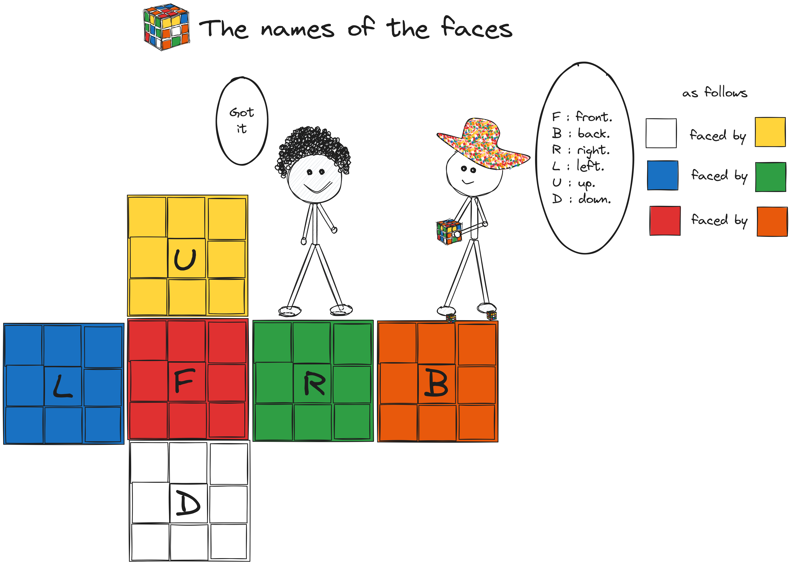

>[!NOTE]
> Hey dude, this version of the tutorial is for beginners.

### Table of content

1. [Understand the Cube.```3x3```](#desc0)

<a name="desc0"></a>
### Understand the Cube.```3x3```
  - [The names of the faces.](#faces-names)
  - [Describing movements using notation.](#notation)

<a name="faces-names"></a>
#### The names of the faces.



<a name="notation"></a>
#### Describing movements using notation.


